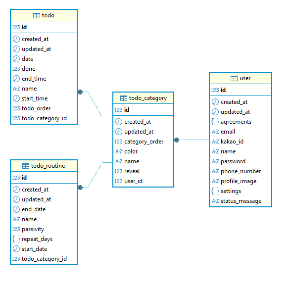

# `Tododook`
링크 : https://tododook.com

## `목차`

- [개요](#개요)
- [주요 기능](#주요-기능)
- [기술 스택](#기술-스택)
- [DB 설계](#db-설계)
- [DB ERD](#db-erd)
- [API Endpoint](#api-endpoint)

## `개요`
일정을 관리하고 내가 등록한 일정을 얼마나 수행 했는지 편리하게 확인할 수 있는 서비스입니다.

## `주요 기능`
- 일정관리 : 내가 해야할 일을 캘린더에 기록하고 완료했다면 체크하여 일정을 관리합니다.
- 타임라인 : 내가 등록해놓은 시간을 기반으로 시간 단위로 나의 일정을 볼 수 있습니다.
- 히스토리 : 내가 등록한 일정의 완료 여부를 각 카테고리별로 확인해볼 수 있습니다.

## `기술 스택`

| 구분 | 기술 스택 | 
|-----------|------|
| BE | Java, Spring Boot, JPA | 
| FE | HTML, CSS, React | 
| DB | MySQL | 
| IDE | Cursor, IntelliJ | 
| INFRA | AWS EC2, AWS S3, Docker, Terraform, Python, Kakao OAuth, GitHub Actions, Redis, Nginx |
| ETC | Kakao OAuth, GitHub |

## `DB 설계`

> 모든 테이블은 `id` (BIGINT, PK, AUTO_INCREMENT), `created_at` (DATETIME), `updated_at` (DATETIME) 컬럼을 공통으로 가집니다. (`BaseEntity` 상속)

### user

| 컬럼명 | 타입 | 제약조건 | 설명 |
|---|---|---|---|
| id | BIGINT | PK, AUTO_INCREMENT | 인덱스 번호 |
| name | VARCHAR | NOT NULL, UNIQUE | 유저 이름 |
| email | VARCHAR | NOT NULL, UNIQUE | 이메일 |
| password | VARCHAR | NOT NULL | 비밀번호 |
| phone_number | VARCHAR | UNIQUE | 전화번호 |
| settings | JSON | | 유저 설정 모음 |
| agreements | JSON | | 유저 동의 항목 |
| kakao_id | VARCHAR | UNIQUE | 카카오 OAuth ID |
| profile_image | VARCHAR | UNIQUE | 프로필 이미지 URL |
| status_message | VARCHAR | | 상태 메시지 |
| created_at | DATETIME | | 생성일 |
| updated_at | DATETIME | | 수정일 |

### todo_category

| 컬럼명 | 타입 | 제약조건 | 설명 |
|---|---|---|---|
| id | BIGINT | PK, AUTO_INCREMENT | 인덱스 번호 |
| user_id | BIGINT | FK → user.id, NOT NULL | 유저 번호 |
| name | VARCHAR | NOT NULL | 카테고리 명 |
| color | VARCHAR | NOT NULL | 카테고리 색상 |
| category_order | INT | NOT NULL | 카테고리 순서 |
| reveal | BOOLEAN | NOT NULL | 카테고리 공개 여부 |
| created_at | DATETIME | | 생성일 |
| updated_at | DATETIME | | 수정일 |

### todo_routine

| 컬럼명 | 타입 | 제약조건 | 설명 |
|---|---|---|---|
| id | BIGINT | PK, AUTO_INCREMENT | 인덱스 번호 |
| todo_category_id | BIGINT | FK → todo_category.id, NOT NULL | 카테고리 번호 |
| name | VARCHAR | NOT NULL | 루틴 명 |
| start_date | DATE | NOT NULL | 루틴 시작 날짜 |
| end_date | DATE | NOT NULL | 루틴 마감 날짜 |
| passivity | BOOLEAN | NOT NULL | 루틴 수동 할 일 추가 여부 |
| repeat_days | JSON | | 루틴 반복 설정 |
| created_at | DATETIME | | 생성일 |
| updated_at | DATETIME | | 수정일 |

### todo

| 컬럼명 | 타입 | 제약조건 | 설명 |
|---|---|---|---|
| id | BIGINT | PK, AUTO_INCREMENT | 인덱스 번호 |
| todo_category_id | BIGINT | FK → todo_category.id, NOT NULL | 카테고리 번호 |
| name | VARCHAR | NOT NULL | 할 일 명 |
| date | DATE | NOT NULL | 할 일 날짜 |
| done | BOOLEAN | NOT NULL, default: false | 할 일 완료 여부 |
| start_time | TIME | | 할 일 시작 시간 |
| end_time | TIME | | 할 일 종료 시간 |
| todo_order | INT | NOT NULL | 할 일 순서 |
| created_at | DATETIME | | 생성일 |
| updated_at | DATETIME | | 수정일 |

### repeat_days JSON 구조

| type | 의미 | 추가 필드 | 예시 |
|---|---|---|---|
| `"daily"` | 매일 | 없음 | `{ "type": "daily" }` |
| `"weekly"` | 매주 | `weekly_days` | `{ "type": "weekly", "weekly_days": [1, 3, 5] }` → 월·수·금 |
| `"monthly"` | 매달 | `monthly_days` | `{ "type": "monthly", "monthly_days": [1, 15] }` → 매월 1일, 15일 |
| `"yearly"` | 매년 | `yearly_dates` | `{ "type": "yearly", "yearly_dates": [{ "month": 3, "day": 5 }] }` |

## `DB ERD`

## `API Endpoint`

> 🔒 = JWT 인증 필요 (Authorization: Bearer {token})

### Auth

| 메서드 | 엔드포인트 | 설명 | 인증 |
|---|---|---|---|
| `POST` | `/api/v1/auth/signup` | 회원가입 | - |
| `POST` | `/api/v1/auth/login` | 로그인 | - |
| `GET` | `/api/oauth/kakao/callback?code={code}` | 카카오 OAuth 로그인 | - |

### User

| 메서드 | 엔드포인트 | 설명 | 인증 |
|---|---|---|---|
| `GET` | `/api/v1/users/me` | 내 프로필 조회 | 🔒 |
| `PATCH` | `/api/v1/users/me/name` | 이름 수정 | 🔒 |
| `PATCH` | `/api/v1/users/me/status-message` | 상태 메시지 수정 | 🔒 |
| `PATCH` | `/api/v1/users/me/profile-image` | 프로필 이미지 업로드 (multipart/form-data) | 🔒 |
| `DELETE` | `/api/v1/users/me/profile-image` | 프로필 이미지 삭제 | 🔒 |
| `DELETE` | `/api/v1/users/me` | 회원 탈퇴 | 🔒 |

### Category

| 메서드 | 엔드포인트 | 설명 | 인증 |
|---|---|---|---|
| `GET` | `/api/v1/categories` | 카테고리 목록 조회 | 🔒 |
| `POST` | `/api/v1/categories` | 카테고리 생성 | 🔒 |
| `PUT` | `/api/v1/categories/{id}` | 카테고리 수정 | 🔒 |
| `DELETE` | `/api/v1/categories/{id}` | 카테고리 삭제 | 🔒 |
| `PATCH` | `/api/v1/categories/reorder` | 카테고리 순서 변경 | 🔒 |

### Todo

| 메서드 | 엔드포인트 | 설명 | 인증 |
|---|---|---|---|
| `GET` | `/api/v1/todos?date={date}` | 날짜별 할 일 목록 조회 | 🔒 |
| `GET` | `/api/v1/todos?categoryId={id}` | 카테고리별 할 일 목록 조회 | 🔒 |
| `POST` | `/api/v1/todos` | 할 일 생성 | 🔒 |
| `PATCH` | `/api/v1/todos/{id}/done` | 할 일 완료 토글 | 🔒 |
| `PATCH` | `/api/v1/todos/{id}/name` | 할 일 이름 수정 | 🔒 |
| `PATCH` | `/api/v1/todos/{id}/date` | 할 일 날짜 수정 | 🔒 |
| `PATCH` | `/api/v1/todos/{id}/time` | 할 일 시간 수정 | 🔒 |
| `PATCH` | `/api/v1/todos/{id}/category` | 할 일 카테고리 이동 | 🔒 |
| `PATCH` | `/api/v1/todos/reorder` | 할 일 순서 변경 | 🔒 |
| `DELETE` | `/api/v1/todos/{id}` | 할 일 삭제 | 🔒 |

### Routine

| 메서드 | 엔드포인트 | 설명 | 인증 |
|---|---|---|---|
| `GET` | `/api/v1/routines?categoryId={id}` | 카테고리별 루틴 목록 조회 | 🔒 |
| `POST` | `/api/v1/routines` | 루틴 생성 | 🔒 |
| `PUT` | `/api/v1/routines/{id}` | 루틴 수정 | 🔒 |
| `DELETE` | `/api/v1/routines/{id}` | 루틴 삭제 | 🔒 |
